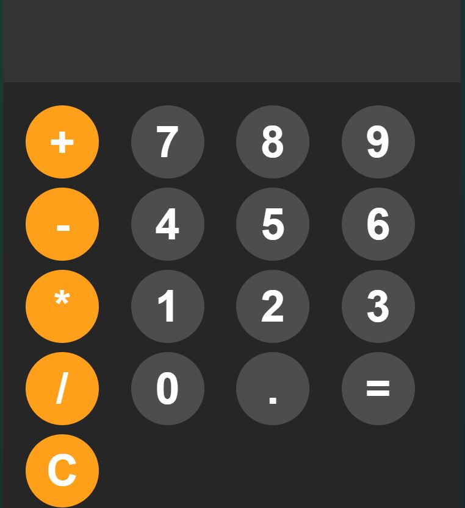

# 🧮 Calculator App  
A simple and responsive calculator built using HTML, CSS, and JavaScript. This app performs basic arithmetic operations with a clean UI and mobile-friendly design.

👉 [Live Demo](https://zunaid990.github.io/calculator-app/)

---

## How It's Made:

**Tech used:** HTML, CSS, JavaScript

This calculator uses:
- **HTML** for the layout and structure of the calculator interface
- **CSS** for styling, layout, responsiveness, and button animations
- **JavaScript** to handle all the calculation logic using `eval()` and manage user input

**Main Features:**
- Addition, subtraction, multiplication, and division
- Decimal support
- Clear (C) button
- Input displayed in real-time
- Responsive layout with modern styling

---

## Optimizations

- Structured code using modular functions
- Used `try/catch` for safe evaluation and error handling
- Styled buttons with hover and active states
- Applied `flexbox` and `grid` layout techniques for responsiveness
- Lightweight and fast performance without any libraries

---

## Lessons Learned:

Through this project, I improved my JavaScript DOM skills, practiced handling real-time user input, and learned how to safely use `eval()` with error handling. I also gained experience in building responsive layouts using CSS Grid and Flexbox.

This project was a great way to reinforce core JavaScript concepts and build a clean, interactive UI.

---

## 🔗 Other Projects:

- [🃏 Card Battle Game](https://zunaid990.github.io/zunaids-card-battle/) – A fun two-player game using the Deck of Cards API.
- [⏱️ Stopwatch App](https://github.com/Zunaid990/Stopwatch-app.git) – A simple stopwatch with start, pause, and reset functions.
